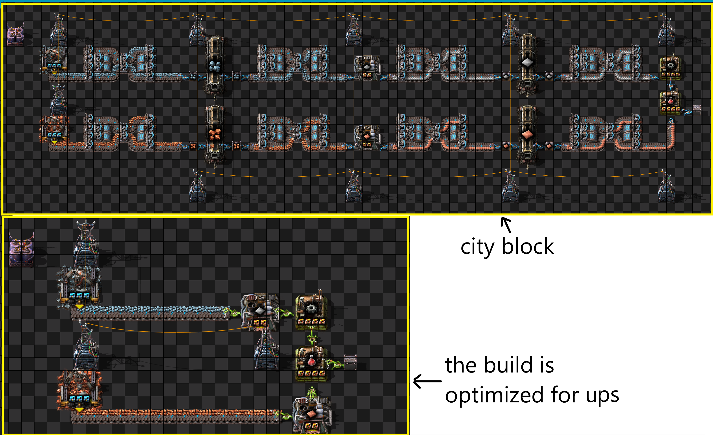

# Factorio-The-impact-of-city-blocks-on-UPS

## 1. Why can a city block be bad for UPS?

Take a close look at the drawing. The drawing shows a comparison of a typical city block with an optimized build.

Let's count the number of inserters:

24 fast inserters vs 6 stack inserters !

Players love fast inserters - they are cheap and beautiful :-)

But the stack size of the fast inserter is 3, versus 12.

And it turns out that for a city block, the inserters make 96 swings, and only 6 swings for an optimized build.

**96 swings vs 6 swings**

This is the main reason for poor UPS for city blocks!

And I forgot about the trains. Trains additionally reduce UPS.

## 2. Optimization of city blocks.

### 2.1. And who is guilty?

Learn a great guide: [(wiki)](https://wiki.factorio.com/Tutorial:Diagnosing_performance_issues)

Remember and better write down the values:

* Class Units
* Class Inserter
* Class Reactor
* Class Boiler
* Heat manager
* Trains
* Electric network

### 2.1. Use beacons !!!

Use B8 or B12. B4 is bad for UPS.

### 2.2. Class Units.

Disable the enemies. Or do not allow pollution to spread to the nests.

### 2.3. Nuclear power plants.

**cost = Class Boiler + Class Reactor + Heat manager**

If the value is high, remove nuclear power plants and use solar panels.

### 2.4. Optimize the loading of ore into trains.

Comparing different methods: [(link)](https://github.com/flameSla/Factorio-Loading-ore-into-the-train)

**Do not use bots to load ore!**

### 2.5. Class Inserter

Use only stack inserters!

Remove the buffer chests, the wagon is also a buffer chest. (This is controversial advice, but it may help)

For melting furnaces, use a clock ( great guide [(link)](https://www.reddit.com/r/technicalfactorio/comments/ju2ngg/inserter_clocking_tutorial/) )

### 2.6. Electric network

The electric network is very insidious. In addition to the electrical network, it includes a Fluid manager. This is due to the peculiarities of multithreading. In statistics, Fluid manager is always 0, but this is not the case. 

How to find out the value of Fluid manager: [(link)](https://www.reddit.com/r/technicalfactorio/comments/mead38/how_to_turn_off_multithreading_to_get_more_useful/)

If you have a mod with a lot of liquid, you may need to optimize the number of pipes.

### 2.7. Bots

Builds on bots are very difficult to optimize.

Compare your build with this one: [(link)](https://www.reddit.com/r/technicalfactorio/comments/f3nje7/10k_spm_bot_base/ )

It is completely different from your build on bots!!!

**The simple way is: don't use bots.**

The hard way: make dozens of benchmarks and make an optimized build on bots.

## 3. Life without city blocks.

City blocks are very convenient: easy to expand, very pleasant to play, easy to play with mods.

How to play without city blocks?

Example: [(500 SPM Cell, Ore delivered by rails belts and bots used internally)](https://www.reddit.com/r/technicalfactorio/comments/koi1re/500_spm_cell_ore_delivered_by_rails_belts_and/)

And another example: [(Belts)](https://www.reddit.com/r/factorio/comments/oqzmer/so_i_built_another_monolithic_megabase_this_time/)

